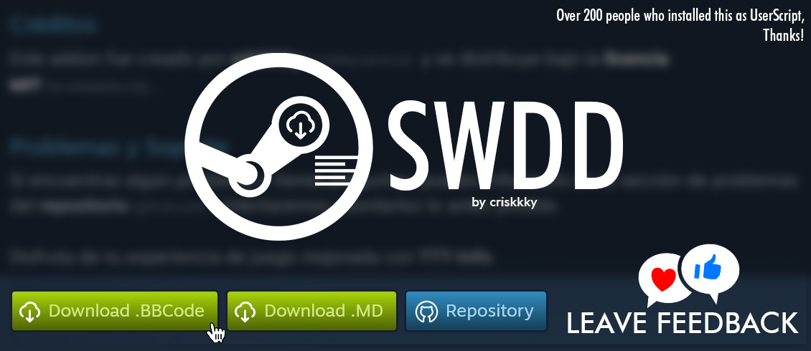

 

> [!WARNING]
> Highly recommend read fully this doc.

# Overview
  
  
## Introduction

SWDD (Steam Workshop Description Downloader) is a project created by criskkky with the purpose to allow download descriptions for workshop published items by other users.

## How it works

SWDD extracts the description of a published content in Steam workshop through functions in JavaScript that were called by clicking one of those green download buttons provided at the end of the desired description.
The format of the downloaded file depends on your selection (currently supports `.bbcode` or `.md`), you will get your file inmediate 'cos it's not made through a server, it makes a real-time conversion and file deployment.

This function is quite useful for developers who may need to replicate the description posted on Steam or in the case of uploading modified editions of another addon, we also need to write exactly the same content as in the original post along with minor changes.

## Common Inquiries
<ol>
  <li>Your data is <b>NOT</b> collected.
  <li>This code is <b>NOT</b> against Steam TOS, so <b>you won't receive</b> a <b>VAC BAN</b>.
  <li>If it doesn't work, there's a 99% chance it's due to compatibility issues with other userscripts or addons. Disabling them could help.
  <li>Downloads are <b>unlimited</b>, so don't worry about how many downloads are you allowed to do.
  <li>I avoided the use of libs (enhancing code transparency, FREE from cheats, tricks, or hidden things).
  <li>Script won't ask you grant permissions.
  <li>To keep your code updated you must not touch the original code.
</ol>

## How to install
Here you can choose two ways.

1. UserScript [LIGHT VERSION]
- Must have an UserScript Addon like [Tampermonkey](https://www.tampermonkey.net/).
- Go to → https://greasyfork.org/en/scripts/483563-swdd-steam-workshop-description-downloader
- Click "Install this script"
- Done.

2. Installing as Addon. [FULL VERSION]
    - NOT AVAILABLE FOR NOW. (Currently in development, will include more features than the UserScript).
    - Click the eye 👁 "Watch" to stay tuned.

## How to use
1. Go to Workshop Publication (https://steamcommunity.com/workshop/)
2. Take a look at the end of description
3. You will find two buttons, click download .MD or .BBCode file
4. Then download starts and you get your desired file. That's all folks!
5. Leave a star to the repo ⭐ **or** ⭐⭐⭐⭐⭐ to the add-on website 💜

## Supported Conversions
> [!NOTE]
> ❌ = **Unsupported** 
> ⚠️ = **May be unaccurate** 
> ✔ = **Working**

| Syntax | to BBCode | to MD |
|--------|-----------|-------|
| `<h1>` | ✔ | ✔ |
| `<h2>` | ✔ | ✔ |
| `<h3>` | ✔ | ✔ |
| `<b>` | ✔ | ✔ |
| `<u>` | ✔ | ✔ |
| `<i>` | ✔ | ✔ |
| `<strike>` | ✔ | ✔ |
| `<spoiler>` | ✔ | ✔ |
| `<noparse>` | ❌ | ❌ |
| `
` | ✔ | ✔ |
| `<url>` | ✔ | ✔ |
| `<list>` | ✔ | ✔ |
| `<olist>` | ✔ | ✔ |
| `<quote>` | ⚠️ | ⚠️ |
| `<code>` | ✔ | ✔ |
| `<table>` | ❌ | ❌ |
| `<tr>` | ✔ | ❌ |
| `<th>` | ✔ | ❌ |
| `<td>` | ✔ | ❌ |

## LICENSE
SWDD (STEAM WORKSHOP DESCRIPTION DOWNLOADER)
Made by https://github.com/criskkky/

SCRIPT/ADDON LICENSE AGREEMENT

You are free to use, modify, contribute, or distribute the SWDD ("SCRIPT/ADDON") as long as it is exclusively intended for use with Steam Workshop.
Any changes or modifications made and publicly shared must include this license and provide a link back to the original repository on GitHub in your credits page.

You are, however, NOT permitted to use the SCRIPT/ADDON for:
- Commercial Purposes, including selling the codes.

THE SCRIPT/ADDON IS PROVIDED "AS IS," WITHOUT WARRANTY OF ANY KIND, EXPLICIT OR IMPLIED, INCLUDING BUT NOT LIMITED TO THE WARRANTIES OF MERCHANTABILITY, FITNESS FOR A PARTICULAR PURPOSE, AND NONINFRINGEMENT. IN NO EVENT SHALL THE AUTHORS OR COPYRIGHT HOLDERS BE LIABLE FOR ANY CLAIM, DAMAGES, OR OTHER LIABILITY, WHETHER IN AN ACTION OF CONTRACT, TORT, OR OTHERWISE, ARISING FROM, OUT OF, OR IN CONNECTION WITH THE SCRIPT/ADDON OR THE USE OR OTHER DEALINGS IN THE SCRIPT/ADDON.

just tags here: swdd, steamworkshopdescriptiondownloader, download any steam description from workshop, how to fast copy workshop descriptions, steam workshop download

